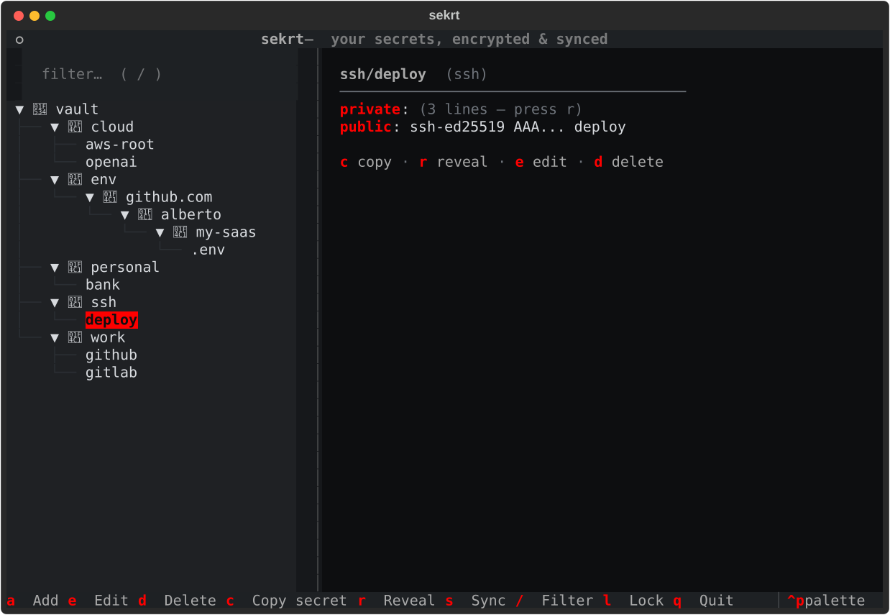

# 🔐 keyp

> **keep** your **keys**. And your passwords, SSH keys and `.env` files —
> encrypted, in your own git repo, four keystrokes away.

A fast TUI + CLI secret manager for developers and DevOps engineers.
Like [`pass`](https://www.passwordstore.org/), but with a modern
[Textual](https://textual.textualize.io/) interface, first-class **API key**,
**SSH keypair** and **`.env` file** support, and painless sync through any
private git remote (GitHub, GitLab, self-hosted — anything).



- 🔑 **Passwords & API keys** — organised in folders, generated, copied with auto-clearing clipboard
- 📄 **`.env` files** — encrypt the `.env` of any repo into your vault, restore it in any fresh clone with one command
- 🗝️ **SSH keypairs** — import, generate (ed25519), and restore with correct permissions
- ☁️ **Git sync** — every change is a commit; `keyp sync` pushes/pulls a private repo
- 🖥️ **TUI + CLI** — a full keyboard-driven interface *and* script-friendly commands
- 🪶 **Lightweight** — three dependencies (`textual`, `click`, `cryptography`), no daemon, no sudo, no gpg setup

## Install

```bash
uv tool install keyp      # recommended
# or: pipx install keyp
# or: pip install --user keyp
```

## Quickstart

```bash
keyp init --remote git@github.com:you/secrets.git   # create vault + connect a PRIVATE repo
keyp add work/github -u alberto -g                  # generate & store a password
keyp get work/github -c                             # copy it (clipboard clears in 45s)
keyp                                                # open the TUI
keyp sync                                           # pull + push the encrypted vault
```

Run `keyp unlock` once and commands stop prompting for your passphrase for
an hour (cached in a RAM-backed, user-private runtime dir — like gpg-agent,
without the agent).

## The `.env` workflow

`.env` files never land in your project repos — so every fresh clone starts
with a scavenger hunt. keyp ends it:

```bash
cd ~/code/my-saas        # any git repo
keyp env push         # encrypts .env into the vault, keyed by the repo's origin URL
keyp sync
```

Months later, on another machine:

```bash
git clone git@github.com:you/my-saas.git && cd my-saas
keyp env pull         # .env is back, byte for byte (0600 perms)
```

It works with multiple env files per repo (`keyp env push apps/api/.env.production`),
detects unchanged/modified files, never overwrites local edits without
`--force`, and `keyp env ls` shows everything you've stored.

## SSH keys

```bash
keyp ssh add laptop --key ~/.ssh/id_ed25519    # import an existing keypair
keyp ssh add deploy --generate                 # or generate a fresh ed25519 key
keyp ssh pub deploy                            # print the public key for GitHub
keyp ssh restore deploy --dir ~/.ssh           # on a new machine: 0600/0644, done
```

## The TUI

`keyp` with no arguments opens the interface: a folder tree of your vault,
fuzzy filtering, masked detail view, add/edit forms with a password generator,
and one-key sync.

| Key | Action                              |
| --- | ----------------------------------- |
| `/` | filter entries                      |
| `c` | copy secret (auto-clears in 45s)    |
| `r` | reveal / mask fields                |
| `a` / `e` / `d` | add / edit / delete     |
| `s` | sync with the git remote            |
| `l` | lock the vault                      |
| `q` | quit                                |

## CLI reference

```text
keyp init [--remote URL]      create a vault
keyp add NAME [-u USER] [-g]  add password/api_key/note   (alias: insert)
keyp get NAME [-c] [-f FIELD] print or copy a secret
keyp show NAME [--reveal]     show all fields
keyp ls [PREFIX]              list entries                (alias: list)
keyp find QUERY               search names                (alias: search)
keyp edit NAME                edit fields in $EDITOR
keyp mv OLD NEW               rename                      (alias: rename)
keyp rm NAME [-f]             delete                      (alias: remove)
keyp generate [LEN] [--token] generate without storing
keyp env push|pull|ls|show|rm .env files per repository
keyp ssh add|restore|ls|pub   SSH keypairs
keyp remote URL               set the sync remote
keyp sync                     pull --rebase + push
keyp autosync on|off          push automatically on every change
keyp git <args...>            raw git inside the vault
keyp unlock [-t MIN] / lock   cache / forget the vault key
keyp passwd                   change passphrase (re-encrypts everything)
keyp status                   vault, remote, session info
```

## Security model

- **Encryption**: every entry is an independent file encrypted with
  **AES-256-GCM**. The key is derived from your passphrase with **scrypt**
  (N=2¹⁵, r=8, p=1, random per-vault salt).
- **Tamper binding**: an entry's logical name is the GCM associated data —
  a ciphertext moved or renamed by an attacker fails to decrypt.
- **What the remote sees**: entry *names* and folder structure (like `pass`),
  timestamps, and commit history. Entry *contents* are always ciphertext.
  Use names accordingly (`work/github`, not `password-is-hunter2`).
- **Session cache**: `keyp unlock` stores the derived key (never the
  passphrase) in `$XDG_RUNTIME_DIR` — tmpfs on Linux: RAM-backed, user-only
  (0600), wiped on logout — with a TTL. `keyp lock` clears it immediately.
- **Clipboard**: auto-clears after 45 s, and only if it still holds the copied
  value. Secrets are never passed through argv.
- **Files**: vault dir `0700`, entries `0600`, atomic writes, restored SSH
  keys `0600`/`0644`.
- **Threat model**: protects secrets at rest and in your git remote. It does
  **not** protect against an attacker with root/physical access to your
  unlocked machine — nothing userspace does.

Found a vulnerability? Please report it privately via GitHub security
advisories rather than a public issue.

## Vault location & configuration

| What | Default | Override |
| --- | --- | --- |
| Vault directory | `~/.local/share/keyp` | `$KEYP_VAULT` |
| Passphrase (CI/scripts) | interactive prompt | `$KEYP_PASSPHRASE` |
| Editor for `keyp edit` | `$EDITOR` | `$VISUAL` |

The vault is a plain git repository — inspect it any time with
`keyp git log`.

## Why not just `pass`?

`pass` is excellent, and keyp borrows its best idea (one encrypted file
per secret, git-friendly). Differences: no GPG key management — a single
passphrase with scrypt+AES-GCM; a real TUI; structured entries (username,
URL, notes — not just a text blob); and purpose-built `.env` and SSH-key
workflows.

## Development

```bash
git clone https://github.com/albertorota/keyp && cd keyp
uv sync                 # installs everything incl. dev deps
uv run pytest           # tests
uv run ruff check .     # lint
uv run keyp --help
```

Contributions welcome — see [CONTRIBUTING.md](CONTRIBUTING.md).

## Roadmap

- [ ] `keyp grep` — search inside decrypted entries
- [ ] TOTP / 2FA codes (`keyp otp NAME`)
- [ ] Import from `pass`, Bitwarden, 1Password CSV
- [ ] Diceware passphrase generation
- [ ] Windows clipboard & session-cache support

## License

[MIT](LICENSE)
