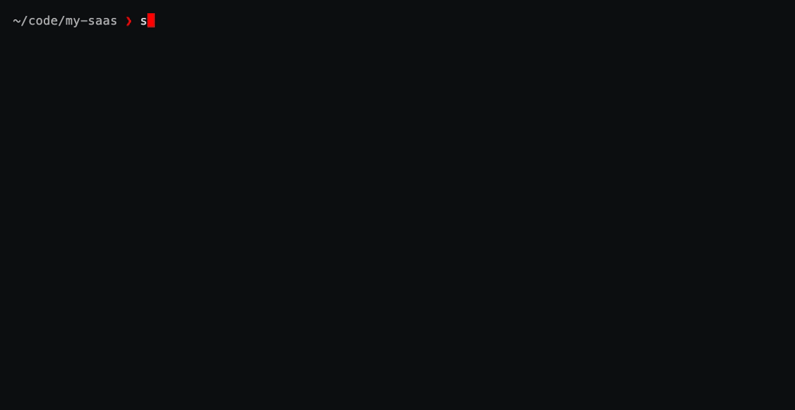
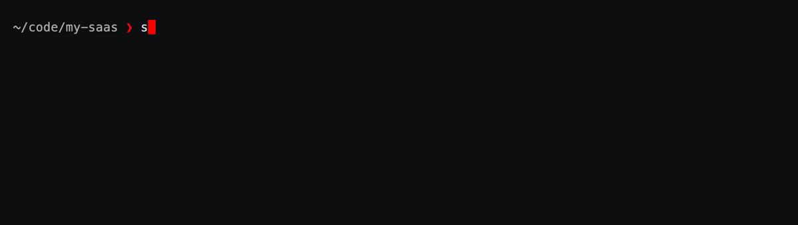
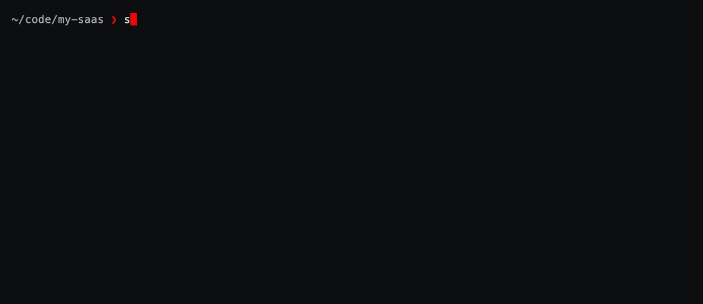

# 🔐 sekrt

[](https://pypi.org/project/sekrt/)
[](https://github.com/alberto-rota/sekrt/actions/workflows/ci.yml)
[](https://pypi.org/project/sekrt/)
[](LICENSE)

> **sekrt** — *secret*, with the vowels taken out.
> Everything else is AES-256, and only you can read it.

A fast TUI + CLI secret manager for developers and DevOps engineers.
Like [`pass`](https://www.passwordstore.org/), but with a modern
[Textual](https://textual.textualize.io/) interface, first-class **API key**,
**SSH keypair** and **`.env` file** support, and painless sync through any
private git remote (GitHub, GitLab, self-hosted — anything).



*Store a generated API key, hand it to a command, then browse the same vault
in the TUI — one session, start to finish.*

- 🔑 **Passwords & API keys** — organised in folders, generated, copied with auto-clearing clipboard
- 📄 **`.env` files** — encrypt the `.env` of any repo into your vault, restore it in any fresh clone with one command
- 🏃 **`sekrt run`** — hand a command your secrets in its environment only, for exactly as long as it runs
- 🗝️ **SSH keypairs** — import, generate (ed25519), and restore with correct permissions
- ☁️ **Git sync** — every change is a commit; `sekrt sync` pushes/pulls a private repo
- 🖥️ **TUI + CLI** — a full keyboard-driven interface, script-friendly commands, and a few lines of inline picker or form when you leave a name out
- 🪶 **Lightweight** — three dependencies (`textual`, `click`, `cryptography`), no daemon, no sudo, no gpg setup

## Contents

- [Install](#install)
- [Quickstart](#quickstart)
- [Syncing with a git remote](#syncing-with-a-git-remote)
- [The `.env` workflow](#the-env-workflow)
- [Running a command with your secrets](#running-a-command-with-your-secrets)
- [SSH keys](#ssh-keys)
- [Whole files](#whole-files)
- [The TUI](#the-tui)
- [The inline picker](#the-inline-picker)
- [Inline forms](#inline-forms)
- [Revealing a secret](#revealing-a-secret)
- [Colors](#colors)
- [CLI reference](#cli-reference)
- [Security model](#security-model)
- [Vault location & configuration](#vault-location--configuration)
- [Why not just `pass`?](#why-not-just-pass)
- [Development](#development)
- [Roadmap](#roadmap)

## Install

```bash
uv tool install sekrt      # recommended
# or: pipx install sekrt
# or: pip install --user sekrt
```

Requires Python 3.11+. Nothing else to set up — no daemon, no GPG keyring,
no sudo.

## Quickstart

```bash
sekrt init                             # create a vault at ~/.local/share/sekrt
sekrt add work/github -u alberto -g    # generate & store a password
sekrt get work/github -c               # copy it (clipboard clears in 45s)
sekrt                                  # open the TUI
```

On a second machine, `init` asks whether you already have a vault in a git repo
and clones it for you if so — or skip the question with `sekrt clone <url>`.

That's a working local vault. `init` prompts you to choose (and confirm) a
passphrase — that passphrase *is* the vault; there's no recovery if you
lose it, so pick something you'll remember, and see the
[security model](#security-model) below before you rely on it for real.

Anything that touches a secret asks for the passphrase — `ls`, `find`, `rm` and
`status` never do, because they decrypt nothing. `sekrt unlock` stops the asking
for an hour, courtesy of a RAM-backed, user-private key cache: `gpg-agent`,
without the agent.

```bash
sekrt unlock              # cache the key for 60 min
sekrt get work/github -c  # no prompt this time
sekrt lock                # forget it now
```

## Syncing with a git remote

The vault is a plain git repository. `sekrt sync` is `git pull --rebase`
then `git push` against `origin` — so you need an empty **private** repo to
point it at (GitHub, GitLab, Gitea, a bare repo over SSH — anything git can
push to).

```bash
# 1. create an empty private repo, e.g. `gh repo create secrets --private --clone=false`
sekrt remote git@github.com:you/secrets.git   # or: sekrt init --remote <url> on a fresh vault
sekrt sync                                    # first push
```

On every **other** machine, `sekrt init` asks the one question that matters and
does the right thing with the answer:

```console
$ sekrt init
Do you already have a sekrt vault pushed to a git repo? [y/N]: y
Vault repo URL: git@github.com:you/secrets.git
✔ vault cloned to ~/.local/share/sekrt
  3 entries available
  unlock with the passphrase that created this vault: `sekrt unlock`
```

`sekrt clone <url>` does the same thing in one shot if you'd rather not be asked.

> [!IMPORTANT]
> A second machine must *clone* the vault, not create one. `init` generates a
> new encryption salt and a new git root, so two independently-created vaults
> share no history and cannot decrypt each other's entries. Cloning reuses the
> existing salt, which is why your original passphrase keeps working. You don't
> have to remember this: the prompt above steers you, `init --remote <url>` and
> `remote <url>` refuse when the remote already holds a vault, and `sync`
> refuses the impossible merge instead of corrupting anything.

Every `add`/`edit`/`mv`/`rm` auto-commits locally; `sekrt sync` is what
actually talks to the remote. Want every change pushed immediately instead?

```bash
sekrt autosync on
```

Remember: the remote only ever sees ciphertext and entry *names* — see
[what the remote sees](#security-model) below.

## The `.env` workflow

`.env` files never land in your project repos — so every fresh clone starts
with a scavenger hunt. sekrt ends it:

```bash
cd ~/code/my-saas       # any git repo
sekrt env push         # encrypts .env into the vault, keyed by the repo's origin URL
sekrt sync
```

Months later, on another machine:

```bash
git clone git@github.com:you/my-saas.git && cd my-saas
sekrt env pull         # .env is back, byte for byte (0600 perms)
```


The key is the repo's `origin` URL, not the path on disk — so a clone anywhere
finds its own file, and HTTPS vs SSH remotes resolve to the same key. It
handles several env files per repo (`sekrt env push .env apps/*/.env.*`),
reports what actually changed rather than rewriting blindly, and never
overwrites a local file you've edited without `--force`.

**📄 [Full guide: the `.env` workflow](docs/env.md)** — how repos are
identified, monorepos with one env file per service, the overwrite rules, using
`--repo` for forks and renames, what the remote can see, and troubleshooting.

## Running a command with your secrets

`sekrt expose && service log --token="$MY_TOKEN"` cannot work — a child process
can't set variables in the shell that started it. So sekrt wraps the command
instead, and the secrets live in *its* environment, for exactly as long as it
runs:

```bash
sekrt run 'npm start'                             # everything, like a loaded .env
sekrt run -e UV_PUBLISH_TOKEN 'uv publish'        # or just the one
sekrt run 'service log --token="$MY_TOKEN"'       # a shell expands the reference
sekrt shell -e UV_PUBLISH_TOKEN                   # a subshell; `exit` revokes
```

`sekrt shell` tags its prompt — `(sekrt) ~/code/my-saas ❯` — so a shell holding
secrets never looks like an ordinary one, and leaves your theme, aliases and
history exactly as they were (bash, zsh and fish).


With nothing named, a command gets every `password` and `api_key` entry — under
the variable its name reads as, so `api/my-token` is `$MY_TOKEN` — plus whatever
this repo stored with `sekrt env push`. Notes, SSH keys and stored files stay out.
`-e` narrows it to what you name; `-n` shows what a command would get, names and
sources only. Never written to disk, never left in your shell, never put in a
command line (`ps` can read those), and `$SEKRT_PASSPHRASE` is stripped from the
child.

`sekrt shell` asks you to be specific, because a subshell lasts as long as you
leave it open and hands its variables to everything you start from it: name them
with `-e`, or type no flags at all and get this repo's stored `.env` files and
nothing else. The whole vault takes `sekrt shell --all`, which spells out what
that means and asks before opening anything (`--yes` to skip the question).

> [!IMPORTANT]
> **Your shell expands what you type, before sekrt runs.** Only sekrt's *child*
> knows the values, so `sekrt run "echo $MY_TOKEN"` in double quotes prints an
> empty line. Single-quote it — `sekrt run 'echo $MY_TOKEN'` — or check with
> `sekrt run -- printenv MY_TOKEN`.

**🏃 [Full guide: running commands with your secrets](docs/run.md)** — what is and
isn't exposed and why, narrowing it for code you don't control, the two forms,
`$SEKRT_EXPOSED` in your prompt, and troubleshooting.

## SSH keys

```bash
sekrt ssh add laptop --key ~/.ssh/id_ed25519    # import an existing keypair
sekrt ssh add deploy --generate                 # or generate a fresh ed25519 key
sekrt ssh pub deploy                            # print the public key for GitHub
sekrt ssh restore deploy --dir ~/.ssh           # on a new machine: 0600/0644, done
```

## Whole files

For anything bigger than a note — a list of MFA recovery codes, a keystore,
a PDF — `sekrt file` encrypts the file itself, byte-for-byte, no `$EDITOR`
round-trip:

```bash
sekrt file add mfa/github-recovery ~/Downloads/recovery-codes.txt
sekrt file get mfa/github-recovery                    # restores original filename, cwd
sekrt file get mfa/github-recovery -o ./codes.txt      # or pick the destination
sekrt file ls
```

Binary-safe (content is base64-encoded at rest), and `sekrt show` only
prints its size — use `file get` to get the bytes back out.

## The TUI

`sekrt` with no arguments (or `sekrt tui`) opens the interface: a folder
tree of your vault, fuzzy filtering, a masked detail view, add/edit forms
with a built-in password generator, and one-key sync.


| Key | Action |
| --- | --- |
| `/` | filter entries |
| `c` | copy the entry's secret (auto-clears in 45s) |
| `u` | copy the entry's username |
| `r` | reveal / mask fields |
| `a` / `e` / `d` | add / edit / delete |
| `s` | sync with the git remote |
| `t` | change the colors (see [Colors](#colors)) |
| `l` | lock the vault (prompts for the passphrase again) |
| `q` | quit |

`.env`, SSH and file entries show up in the tree read-only — add, restore
and inspect those from the CLI (`sekrt env`, `sekrt ssh`, `sekrt file`)
instead.

## The inline picker

Nobody remembers `cloud/aws-access-key-prod` exactly. Leave the name out — or
type any part of it — and `get`, `show`, `edit` and `rm` open a few lines of
picker under your prompt instead of erroring:

```bash
sekrt get                 # pick from every entry
sekrt get aws             # start filtered to the matches for "aws"
```

```text
🔐 passphrase ❯
 aws
❯ 🔐 cloud/aws-key-staging
  🔐 cloud/aws-access-key-prod
 ↑↓ move · enter print · esc cancel
```

The passphrase comes first, before the list draws — so the entry you pick is the
last thing you do, not the first. The filter matches scattered letters, not just
substrings, so `awsp` finds `aws-access-key-prod`.

The picker draws on stderr, so scripting is untouched: `sekrt get > .token` and
`sekrt get | pbcopy` still put nothing but the secret on stdout. Where there's no
terminal at all — a pipe, cron, CI — commands insist on an exact NAME instead.

## Inline forms

`add` and `ssh add` carry the most flags of any command here, and typing six of
them to store one password is worse than the thing it replaces. Leave the name
out — or pass `-i` to start from what you already typed — and they ask instead:



`tab` (or `↑`/`↓`) moves between fields, `←`/`→` picks on the rows that are a
choice (password / api key / note, generate / import), `ctrl+g` fills the secret
in with a generated one, `enter` saves, `esc` leaves. Same rules as the picker:
drawn on stderr, only as many lines as there are fields, and where there's no
terminal the commands keep insisting on their arguments instead.

## Revealing a secret

`sekrt show` masks the secret fields; `--reveal` (`-r`) prints them — last, after
the metadata, each one alone on an unindented line of its own:

```text
work/github
  type: password
  username: alberto

  password:
aI9lSOSJ%E!@aHrX~R+8

  press c to copy password · any other key to dismiss
```

Nothing ever shares a line with a secret, so a double- or triple-click selects
the value and only the value — and a revealed SSH key comes out pasteable rather
than indented into uselessness. At a terminal, `c` copies it (cleared after 45s);
that prompt is stderr-only and erases itself, so a redirect still catches the
secret and nothing else, and where there's no terminal it never appears.

## Colors

sekrt draws itself in three colors, and they're yours to pick. `sekrt config`
opens a panel under your prompt where `←`/`→` walks eleven ready-made palettes
and applies each as you land on it — swatches, preview *and* the panel's own
chrome repaint together, so a palette is judged in place rather than after a
restart. `enter` keeps it, `esc` leaves everything as it was, `ctrl+r` puts the
stock metal-and-red back.

```text
preset     ███ metal  ███ teal  ███ amber  ███ indigo  ███ magenta  ███ mono
           ███ matrix  ███ ice  ███ violet  ███ rose  ███ sepia
primary    #aaaaaa  ███  borders, titles, entry names
secondary  #6e737a  ███  hints and muted text
accent     #ff0000  ███  cursor, key hints, highlights
────────────────────────────────────────────────────────────────────────────
🔴 sekrt — your secrets, encrypted & synced
❯ 🔐 work/github   password: ••••••••
←→ preset · tab/↑↓ fields · enter save · ctrl+r defaults · esc cancel
```

Eleven, one per hue, so no two cost you a keypress to tell apart. Want one of
your own? `tab` down to the fields and type it: hex (`#00d7af`, `0d7`) or a CSS
name (`cyan`). The same editor is `t` inside the TUI, where the interface behind
it recolors live. The dark background is deliberately fixed — it's what keeps an
arbitrary accent readable.

```bash
sekrt config --preset matrix                     # any of the eleven, by name
sekrt config --preset amber --accent '#ff0088'   # a preset, then tune it
sekrt config --show                              # what's set now, plus the presets
sekrt config --reset                             # back to metal & red
```

Colors live in `~/.config/sekrt/config.json` — *not* in the vault, so tweaking
them is neither a commit nor a push, and each machine can look however you like.
Aliases: `sekrt colors`, `sekrt theme`.

## CLI reference

```text
sekrt init [--remote URL]      create a vault, or clone one if you have it already
sekrt clone URL                set up from an existing vault repo, no questions asked
sekrt add [NAME] [-u USER] [-g] add password/api_key/note  (alias: insert)
sekrt get [NAME] [-c] [-f F]   print or copy a secret
sekrt show [NAME] [--reveal]   show all fields (-r: reveal secrets, c to copy)
sekrt ls [PREFIX]              list entries                (alias: list)
sekrt find QUERY               search names                (alias: search)
sekrt edit [NAME]              edit fields in $EDITOR (notes: raw multiline text)
sekrt mv OLD NEW               rename                      (alias: rename)
sekrt rm [NAME] [-f]           delete                      (alias: remove)
sekrt generate [LEN] [--token] generate without storing
sekrt env push|pull|ls|show|rm .env files per repository    (guide: docs/env.md)
sekrt run 'CMD'                run CMD with your secrets in its env (alias: exec)
sekrt run -e VAR 'CMD'         ...narrowed to VAR   (-n: show, don't run)
sekrt run 'CMD $VAR'           quoted: a shell reads it, so it expands $VAR
sekrt run -- CMD ARGS...       ...or hand over an argv, with no shell at all
sekrt shell -e VAR             a subshell holding VAR; exit revokes (alias: sh)
sekrt shell                    ...or this repo's stored .env files, and no more
sekrt shell --all              ...or the whole vault, after confirming (-y: skip)
sekrt ssh add|restore|ls|pub   SSH keypairs
sekrt file add|get|ls          whole files, binary-safe
sekrt remote URL               set the sync remote
sekrt sync                     pull --rebase + push
sekrt autosync on|off          push automatically on every change
sekrt git <args...>            raw git inside the vault
sekrt unlock [-t MIN] / lock   cache / forget the vault key
sekrt passwd                   change passphrase (re-encrypts everything)
sekrt status                   vault, remote, session info
sekrt config [--preset NAME]   pick the colors    (aliases: colors, theme)
sekrt tui                      open the interactive TUI
```

Every command has `--help` (e.g. `sekrt add --help`) with the full option
list and examples. Where NAME is optional above, omitting it (or typing
part of one) opens the [inline picker](#the-inline-picker) — or, for `add` and
`ssh add`, an [inline form](#inline-forms).



## Security model

- **Encryption**: every entry is an independent file encrypted with
  **AES-256-GCM**. The key is derived from your passphrase with **scrypt**
  (N=2¹⁵, r=8, p=1, random per-vault salt).
- **Tamper binding**: an entry's logical name is the GCM associated data —
  a ciphertext moved or renamed by an attacker fails to decrypt.
- **What the remote sees**: entry *names* and folder structure (like `pass`),
  timestamps, and commit history. Entry *contents* are always ciphertext.
  Use names accordingly (`work/github`, not `password-is-hunter2`).
- **Session cache**: `sekrt unlock` stores the derived key (never the
  passphrase) in `$XDG_RUNTIME_DIR` — tmpfs on Linux: RAM-backed, user-only
  (0600), wiped on logout — with a TTL. `sekrt lock` clears it immediately.
- **Clipboard**: auto-clears after 45 s, and only if it still holds the copied
  value. Secrets are never passed through argv.
- **`sekrt run` / `sekrt shell`**: values are written to the wrapped process's
  environment and nowhere else — not to disk, not to your shell, and never into a
  command line (`ps` is world-readable). `$SEKRT_PASSPHRASE` is stripped from the
  child, so a wrapped command cannot decrypt anything it wasn't handed, and on
  POSIX sekrt `exec`s the command, so nothing of sekrt stays running with the key
  in memory. **Unnamed, the exposure is broad by design**: every password and API
  key in the vault, which is convenient and means a wrapped command — and
  everything it starts — holds your whole working set of credentials. `-e VAR`
  narrows it to what that command actually needs, and `-n` shows what it would
  get; prefer both for anything you didn't write.
- **Files**: vault dir `0700`, entries `0600`, atomic writes, restored SSH
  keys `0600`/`0644`.
- **Threat model**: protects secrets at rest and in your git remote. It does
  **not** protect against an attacker with root/physical access to your
  unlocked machine — nothing userspace does.
- **Your passphrase is the whole game**: anyone who obtains the vault files
  (including whoever hosts your sync remote) can attempt an offline
  brute-force. scrypt makes each guess expensive, but a weak passphrase
  falls anyway — use a long one. sekrt enforces a minimum of 8 characters;
  treat that as a floor, not a target.
- **A compromised remote** cannot read entry contents or swap ciphertexts
  between names (AEAD name binding), but it *can* delete entries, serve you
  an old version of the vault (rollback), or corrupt the vault config. If
  `sekrt sync` suddenly reports missing entries or a passphrase failure,
  investigate before typing your passphrase anywhere else.

Found a vulnerability? Please report it privately via GitHub security
advisories rather than a public issue.

## Vault location & configuration

| What | Default | Override |
| --- | --- | --- |
| Vault directory | `~/.local/share/sekrt` | `$SEKRT_VAULT` |
| Passphrase (CI/scripts) | interactive prompt | `$SEKRT_PASSPHRASE` |
| Editor for `sekrt edit` | `$EDITOR` | `$VISUAL` |
| Colors (`sekrt config`) | `~/.config/sekrt/config.json` | `$SEKRT_CONFIG` |

The vault is a plain git repository — inspect it any time with
`sekrt git log`.

> **Upgrading from `tupacs`?** This project was published under that name
> through 0.1.0. The `TUPACS_*` variables above still work as fallbacks, and
> vaults written by 0.1.0 (`.tup` entry files) are read as-is. Only the vault
> directory needs a hand — see [the migration note](CHANGELOG.md#020).

## Why not just `pass`?

`pass` is excellent, and sekrt borrows its best idea (one encrypted file
per secret, git-friendly). Differences: no GPG key management — a single
passphrase with scrypt+AES-GCM; a real TUI; structured entries (username,
URL, notes — not just a text blob); and purpose-built `.env` and SSH-key
workflows.

## Development

```bash
git clone https://github.com/alberto-rota/sekrt && cd sekrt
uv sync                 # installs everything incl. dev deps
uv run pytest           # tests
uv run ruff check .     # lint
uv run sekrt --help
```

Try changes against a throwaway vault so you never touch your real one:

```bash
export SEKRT_VAULT=/tmp/sekrt-dev SEKRT_PASSPHRASE=dev
uv run sekrt init && uv run sekrt
```

While `$SEKRT_VAULT` is set the unlock prompt names that vault
(`🔐 passphrase sekrt-dev ❯`), so a scratch vault never gets mistaken for the
real one.

Contributions welcome — see [CONTRIBUTING.md](CONTRIBUTING.md).

The `docs/*.gif` demos are recorded with [VHS](https://github.com/charmbracelet/vhs)
from the tapes in `docs/vhs/`. Run them from the repo root with `sekrt` on
`$PATH` (`brew install vhs`, then `uv tool install --editable .`):

```bash
vhs docs/vhs/hero.tape         # -> docs/hero.gif  (the one at the top)
vhs docs/vhs/quickstart.tape   # -> docs/quickstart.gif
vhs docs/vhs/tui.tape          # -> docs/tui.gif (run quickstart.tape first to seed the demo vault)
vhs docs/vhs/env.tape          # -> docs/env.gif
vhs docs/vhs/env-multi.tape    # -> docs/env-multi.gif
vhs docs/vhs/env-safety.tape   # -> docs/env-safety.gif
vhs docs/vhs/run.tape          # -> docs/run.gif
vhs docs/vhs/forms.tape        # -> docs/forms.gif
```

The `hero`, `env`, `run` and `forms` tapes are self-contained: each rebuilds
its fixture — real git repos with remotes, a fresh clone, a scratch vault —
under `/tmp/sekrt-vhs-*` (`setup-hero-demo.sh`, `setup-env-demo.sh`,
`setup-run-demo.sh`) and points `$HOME` at it, so your real vault and
`~/.gitconfig` are never touched. Their fixtures *generate* secrets rather
than piping them in: `sekrt add` reads through `getpass`, which reads
`/dev/tty`, so a pipe is ignored and the recording would hang waiting for a
keyboard.

`docs/screenshot.svg` is a Textual export rather than a recording — a still of
the TUI at full size — so it has its own generator:

```bash
uv run python docs/vhs/make-screenshot.py   # -> docs/screenshot.svg
```

## Roadmap

- [ ] `sekrt grep` — search inside decrypted entries
- [ ] TOTP / 2FA codes (`sekrt otp NAME`)
- [ ] Import from `pass`, Bitwarden, 1Password CSV
- [ ] Diceware passphrase generation
- [ ] Windows clipboard & session-cache support

## License

[MIT](LICENSE)
