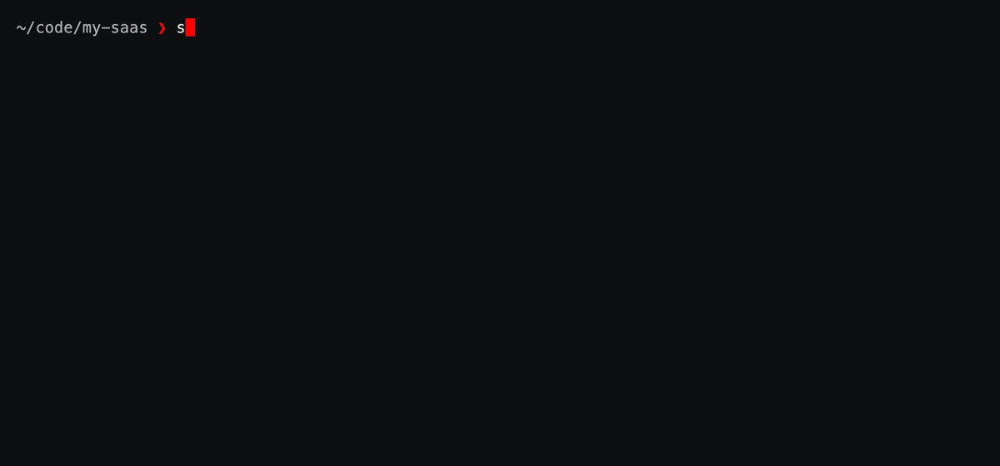
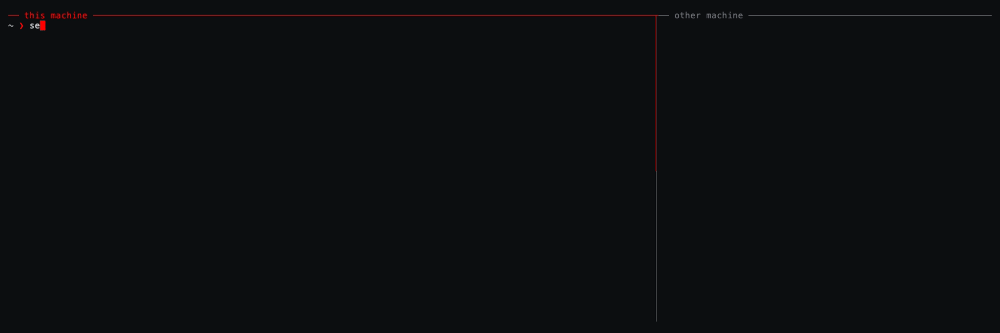

# 🔐 sekrt


[](https://pypi.org/project/sekrt/)
[](https://pypi.org/project/sekrt/)
[](https://github.com/alberto-rota/sekrt/blob/main/LICENSE)

> [!NOTE]
This README **has been written by a real human** and has not been generated by an LLM

A moden secret manager for ALL your secrets. With `sekrt` you store and retrieve your **passwords**, **API keys** and **.env** files from all your machines, seamlessly.
`sekrt` working principle is inspired by [`pass`](https://www.passwordstore.org/): all your secrets are stored encrypted in a github repo, we simplified everything else about it. 


## `sekrt` features
### Password Management
`sektr` can be a simple password manager. You easily store a password, then `sekrt` encrypts it and stores it into a private repo. You`ll retrieve it with your main passphrase whenever you want.

### We push your `.env` 
They told you not to push your `.env` files. We agree, but you can still push it to your safe encrypted vault! `sekrt env push` will register your `.env` file with the current repo. From any other machine you will then `sekrt env pull`: your precious environment variables will be automatically encrypted and stored, and then safely pulled into your new directory.

### Run commands that need secrets securely
`sekrt run` unlocks the vault and gives **one process** decrypted secrets as environment variables; when your process ends, they are gone. Vault `password` and `api_key` entries work on their own (the last path segment becomes the variable: `tokens/uv-publish-token` is `$UV_PUBLISH_TOKEN`); stored `.env` files from `sekrt env push` are an extra source. With nothing named, that command gets every such vault entry plus this repo's `.env`; `-e UV_PUBLISH_TOKEN` is just that one (`--no-env-files` if you don't want the `.env` too). `sekrt shell` opens a subshell until you `exit`, but it is stricter: no flags means this repo's `.env` only, `-e` names what you want, `--all` is the whole vault.

## Installation
`sekrt` ships as a Python package. The suggested route in as a [uv](https://docs.astral.sh/uv/) tool
```bash
uv tool install sekrt   
# or: pip install --user sekrt
```

## Setting up
`sekrt` stores everything in a local vault at `$HOME/.local/share/sekrt`, which gets git-synced to a remote repo if you want all your secrets on all your machine. 

To set everything up:
```bash
sekrt init
```
will create the vault for your and will allow you to paste the URL of a remote repo that you wanna use to sync your secrets across machines. 

The vault is a plain git repository: you need an empty **private** repo to point it at (GitHub, GitLab, Gitea, a bare repo over SSH,  anything git can push to). 
`sekrt init` will ask you for the URL of your remote, but you can override it anytime with 
```bash
sekrt remote git@github.com:you/secrets.git   # or: sekrt init --remote <url> on a fresh vault
```
Every addition, modification or deletion of your secrets auto-commits locally; `sekrt sync` is what actually talks to the remote (basically runs `git pull --rebase` then `git push` against `origin`). Want every change pushed immediately instead?

```bash
sekrt autosync on
```
This behavior is disabled by default.

> [!IMPORTANT]
> **Each vault gets initialize with its unique encryption salt. If your secrets need to be synced across machines, the salt must be inherited.**
> 
> Run `sekrt init` on the first machine you are using sekrt on, then run `sekrt clone REPO_URL` on the other ones.
>
> `sekrt init` will ask if you have a vault on a remote repo and deal with this automatically


`sekrt status` prints the vault path, how many entries it has, the remote, whether autosync is on, and whether you currently have it unlocked. `sekrt passwd` changes the passphrase, re-encrypts every entry, and locks the session. `sekrt git` runs git inside the vault, so `sekrt git log` is the commit history of your secrets.

```bash
sekrt status
sekrt passwd
sekrt git log --oneline
```

## Quickstart

```bash
sekrt add
```


Encrypt and save a secret in the vault with this command. By default a small TUI opens, but you can type in all your entries safely with the CLI command, an example follows.`skert add work/openai -t api_key -u USER`
There is not `--password` or `--secret` argument so that the secret itself is not passed as argv (we don't want it picked up by `ps` or saved in the bash history). 


```bash
sekrt list    # alias: ls
```

List the names of the secrets in the vault.

```bash
sekrt get 
```

Retrieve one specific secret. CLI arguments are available here too. `sekrt get QUERY` searches for exact matches or for partial matches (you will be promped if more than one match is found). 

## Working with an entry

`sekrt get` prints the secret. `sekrt show` prints the rest of the entry as well: type, username, url, notes, with the secret masked. `--reveal` (or `-r`) prints the secret in the clear, and at a terminal `c` copies it.

```bash
sekrt show work/openai
sekrt show work/openai --reveal
sekrt get work/openai -c            # copy the secret, don't print it
sekrt get work/openai -f username   # some other field
```

`sekrt find QUERY` prints every name that contains `QUERY`. Names are stored in the clear, so this one does not ask for the passphrase. `sekrt get QUERY` runs the same search and then asks you to pick when more than one entry matches. Leave the name off (`sekrt show`, `sekrt edit`, `sekrt rm`) and that same picker lists the whole vault. `sekrt ls FOLDER` lists just that folder (alias: `list`).

To change an entry, `sekrt edit` opens it in `$VISUAL` or `$EDITOR`, and falls back to `nano` or `vi`. A note is the raw text. A password or an API key is the JSON of its fields, a flat object of strings. Quit the editor without changing anything and nothing is written back.

```bash
sekrt edit work/openai
```

`sekrt mv` renames an entry (alias: `rename`). The name is bound into the encryption, so the entry is re-encrypted under the new name. `sekrt rm` deletes one (aliases: `remove`, `delete`) and asks first; `-f` skips the question. The entry is gone from the vault, and older copies stay in the git history.

```bash
sekrt mv work/openai work/openai-old
sekrt rm work/openai-old
sekrt git log --oneline             # the history `rm` does not erase
```

`sekrt generate` prints a random password and does not store it (alias: `gen`). Pass a length, or leave it to `sekrt config --length`. `--token` makes a URL-safe token, and `-c` copies instead of printing. To generate and store in one step, `sekrt add NAME -g`.

```bash
sekrt generate
sekrt generate 32 --token
```

## Unlocking the vault
By default, your vault stays locked at all times. Every command you run will ask you for a passphrase to decrypt your secrets. If you need to use a few `sekrt` commands in sequence, you might not want to retype your passphrase every time. 


```bash
sekrt unlock
sekrt add work/openai -t api_key
sekrt get work/openai
sekrt lock
```

Use the `sekrt unlock` command to temporarily disable the passphrase request: you session gets cached on the system RAM for 60 minutes or until you type the `sekrt lock` command. Commands ran while the vault is unlocked will still undergo the same security and cryptography steps even though the passphrase is not specified: `unlock` stores the derived AES-256 key, never the passphrase itself. Entry files on disk stay AES-256-GCM ciphertext; each `add` or `get` still encrypts or decrypts with that key (the entry name is bound as GCM associated data).

A side-utility of `sekrt unlock` is that it also activates tab completion for the shell that ran it (current shells supported are bash, zsh and fish). Entry names are fetched from the list of secrets and are then offered on the `sekrt` commands that take one (`get`, `show`, `rm`, `ssh restore`, and the rest). The shell is offered entry names only, never the actual secrets. 

## The `.env` workflow

`.env` files never land in your project repos: every time you clone your repo you are probably bringing in your .env files in other ways. `sekrt` has a way of fixing this: 

```bash
sekrt env push 
```
When inside a git repository, running `sekrt env push` will detect your .env file, encrypt it and then add it to your vault while keying it to the repository url. 

```bash
sekrt env pull   
```
When you clone your repo elsewhere, `sekrt env pull` will use the repository origin url to fetch the corresponding .env file, decrypt it and bring it into your directory.

`sekrt env show` prints the copy stored for the repo you are in. `sekrt env ls` lists every stored env file and marks this repo's with `*`. `sekrt env rm` deletes that stored copy from the vault and asks first; `-f` skips the question.


### How are repositoties detected correctly for .env syncronization?
The key is the repo's `origin` URL, so a clone anywhere finds its own file. HTTPS and SSH remotes (and URLs with embedded credentials) collapse to the same `host/owner/repo` slug. If you don't sync to a remote, a repo with no `origin` falls back to `local/<directory-name>`, which is per-machine. 

It handles several env files per repo (`sekrt env push .env apps/*/.env.*`) — the path relative to the repo root is part of the key, so a monorepo with one file per service round-trips as a set, a bare `sekrt env pull` restores every file stored for this repo. 

### Can I rename my repo after I synced its .env?
There are two common scenarios:
- You run `sekrt env push` before and after you renamed the origin
- You run `sekrt env pull` after you renamed your origin

In both cases sekrt sees that the old URL is still this repository, moves the stored files onto the new origin, and continues without anything else to type. A clone that still has the old `origin` URL keeps working too. A fork is not a rename, see [forks and worktrees](#how-do-i-deal-with-forks-and-worktrees).

### What if I need a different .env per clone?
Both push and pull compare content first: push reports added / updated / unchanged, and pull never overwrites a local file you've edited unless you pass `--force`. Push treats the working copy as truth; old content stays in the vault's git history.

### How do I deal with forks and worktrees?
To pull a fork or a worktree whose origin differs, name the stored slug: `sekrt env pull --repo github.com/you/my-saas`. Ciphertext is opaque, but entry *names* are not encrypted (they contain the repo host, owner, name, and the file's path within it). If `sekrt env pull` says that nothing is stored, check `git remote -v` (you may be on a `local/` key) or `sekrt env ls` and pull with `--repo`.

## Running commands that need secrets

`sekrt unlock && service log --token="$MY_TOKEN"` won't work, as a child process can't set variables in the shell that started it. The approach we take is to wrap the command instead, and the secrets live in *its* environment, for exactly as long as it runs:

```bash
sekrt run 'npm start'                             # exposes everything to 'npm start'
sekrt run -e UV_PUBLISH_TOKEN 'uv publish'        # or just one secret
```

You'll be prompted for the passphrase before these commands run. Every command will be wrapped and secrets are exposed to its environment only. By default, the command gets exposed to all the secrets in your vault: you can limit which secrets get exposed to the wrapped command by specifying their name after the `-e` CLI arg; `-n` shows what sekrets whould get exposed and under what enironment variable name, acting like a dry-run as the command does not get executed.
> [!IMPORTANT]
> **Your shell expands what you type, before sekrt runs.** Only sekrt's *child* knows the values, so `sekrt run "echo $MY_TOKEN"` in **double quotes** prints an empty line. Single-quotes like `sekrt run 'echo $MY_TOKEN'` is the correct syntax for the expected behavior of `sekrt run`.

An alternative way of running commands is to open a subshell where all secrets are already exposed. You can do so with:
```bash
sekrt shell
```


With this command you open a subshell where your secrets get automatically sourced as environment variables. This becomes particularly useful if you name your secrets as the environment variables that your commands usually expect.

> [!CAUTION]
>If run without any args, the subshell spawned by `sekrt shell` gets every `password` and `api_key` entry under the variable its name reads as, so `api/my-token` is `$MY_TOKEN`, plus whatever the current repo stored with `sekrt env push` if a slug match is found
>
> Restrict which secrets are exposed into the subshell with `-e`: `sekrt shell -e ONLY_THIS_TOKEN` will only expose the requested secret.

> [!IMPORTANT]
Type `exit` to go back to the default shell. The `(sekrt)` prompt is helpful in indicating if your shell is currently expoing secrets.

## SSH keys management
`sekrt` also has features that helps you store, manage and transfer all your SSH keys, with the same security paradigm as everything else. 
```bash
sekrt ssh add DEVICE_NAME --key ~/.ssh/id_ed25519        # import an existing keypair
sekrt ssh add SERVER_NAME --generate                     # or generate a fresh ed25519 ke
sekrt ssh ls                                             # stored keys
sekrt ssh pub DEVICE_NAME                                # print the public key for GitHub
sekrt ssh restore DEVICE_NAME --dir ~/.ssh               # new machine
```
You are able to store your SSH keypairs and retrieve them whenever you need them, even on different machines. Because your vault is synced on a remote repo, you can also use `sekrt` as a way to share your public keys and allow your other machines to accept incoming connections. 

In simpler words: `sekrt ssh authorize` appends the public key to `.ssh/authorized_keys` and leaves the private key in the vault. `sekrt ssh restore DEVICE_NAME --authorize` does that and writes the keypair to disk in the same step. See the example below.
```bash
sekrt ssh authorize DEVICE_NAME                      
```


## Using `sekrt` to encrypt and store any file

Secrets come in all shapes and sizes: a list of MFA recovery codes, a keystore, a PDF, OAuth2 credential, *etc*. `sekrt` is able to tread every file with the same roundtrip designed for the .env, just without keying it to a specific git repo origin slug. 

To this end, `sekrt file add` encrypts any file, byte-for-byte, and stores it in the vault under the name you provide. 

Retrieve it anytime with `sekrt file get`.

```bash
sekrt file add mfa/github-recovery recovery-codes.txt  # encrypts and adds the recovery codes
sekrt file get mfa/github-recovery                     # restores with original filename, cwd
sekrt file get mfa/github-recovery -o ./codes.txt      # or pick the destination
sekrt file ls                                          # List stored files
```
> [!CAUTION]
> `sekrt` will encrypt a file of any size and store it in the **local** vault with no issues. However, blobs larger than 100MB will likely get rejected on push. `sekrt` will print a warning when the file encrypted binary that it generates is over 100MB.
> ```
> ✔ stored file/big (125829120 bytes)
> note: this file is 120.0 MB. Encryption makes it larger still, and
> GitHub/GitLab reject blobs over 100 MB. `sekrt sync` will fail, and
> `sekrt rm` will not drop the blob from vault history.
> The secret can be stored locally, but do not sync. You can undo this with: sekrt git reset > --hard HEAD~1
> ```

## The TUI [WIP]

`sekrt` with no arguments (or `sekrt tui`) opens a TUI interface: a folder tree of your vault, fuzzy filtering, a masked detail view, add/edit forms with a built-in password generator, and one-key sync.


| Key | Action |
| --- | --- |
| `/` | filter entries |
| `c` | copy the entry's secret (clipboard clears; 45s by default) |
| `u` | copy the entry's username |
| `r` | reveal / mask fields |
| `a` / `e` / `d` | add / edit / delete |
| `s` | sync with the git remote |
| `t` | colors, unlock time, clipboard clear, generated length |
| `l` | lock the vault (prompts for the passphrase again) |
| `q` | quit |

`.env`, SSH and file entries show up in the tree read-only: add, restore and inspect those from the CLI (`sekrt env`, `sekrt ssh`, `sekrt file`) instead.

## Configuration
You can configure a few parameters with a small TUI form that you can call with 
```bash
skert config
```

Navigate with arrows, exit saving with `Enter`, exit without saving with `esc`.

The CLI version is available aswell: `--unlock` is how long `sekrt unlock` stays open (60 minutes default). `--clipboard` is how long a copied secret stays (45 seconds, for every copy). `--length` is the character lenght of the randomly generated secrets.
```bash
sekrt config --preset matrix                     # any of the eleven, by name
sekrt config --preset amber --accent '#ff0088'   # a preset, then tune it
sekrt config --unlock 120                        # `sekrt unlock` stays open for 2 hours
sekrt config --clipboard 15                      # copied secrets clear after 15 seconds
sekrt config --length 32                         # generated secrets are 32 characters
sekrt config --show                              # what's set right now, plus the presets
sekrt config --reset                             # colors back to metal & red
```
> [!NOTE]
`sekrt config --clipboard` will not affect your clipboard history

## Vault location & configuration

| What | Default | Override |
| --- | --- | --- |
| Vault directory | `~/.local/share/sekrt` | `$SEKRT_VAULT` |
| Passphrase (CI/scripts) | interactive prompt | `$SEKRT_PASSPHRASE` |
| Editor for `sekrt edit` | `$EDITOR` | `$VISUAL` |
| Preferences (`sekrt config`) | `~/.config/sekrt/config.json` | `$SEKRT_CONFIG` |


## CLI reference

```text
sekrt init [--remote URL]      create a vault, or clone one if you have it already
sekrt clone URL                set up from an existing vault repo, no questions asked
sekrt add [NAME] [-u USER] [-g] add password/api_key/note  (alias: insert)
sekrt get [NAME] [-c] [-f F]   print or copy a secret
sekrt show [NAME] [--reveal]   show all fields (-r: reveal secrets, c to copy)
sekrt ls [PREFIX]              list entry names            (alias: list)
sekrt find QUERY               search names                (alias: search)
sekrt edit [NAME]              edit fields in $EDITOR (notes: raw multiline text)
sekrt mv OLD NEW               rename                      (alias: rename)
sekrt rm [NAME] [-f]           delete                      (alias: remove)
sekrt generate [LEN] [--token] generate without storing
sekrt env push|pull|ls|show|rm .env files per repository    (guide: docs/env.md)
sekrt run 'CMD'                run CMD with your secrets in its env (alias: exec)
sekrt run -e VAR 'CMD'         ...narrowed to VAR   (-n: show, don't run)
sekrt run 'CMD $VAR'           quoted: a shell reads it, so it expands $VAR
sekrt run -- CMD ARGS...       ...or hand over an argv, with no shell at all
sekrt shell -e VAR             a subshell holding VAR; exit revokes (alias: sh)
sekrt shell                    ...or this repo's stored .env files, and no more
sekrt shell --all              ...or the whole vault, after confirming (-y: skip)
sekrt ssh add|restore|ls|pub|authorize   SSH keypairs
sekrt file add|get|ls          whole files, binary-safe
sekrt remote URL               set the sync remote
sekrt remote -v                print the sync remote URL
sekrt sync                     pull --rebase + push
sekrt autosync on|off          push automatically on every change
sekrt git <args...>            raw git inside the vault
sekrt unlock [-t MIN] / lock   cache / forget the vault key (default: `sekrt config`)
sekrt completion bash|zsh|fish  print the tab-completion snippet
sekrt passwd                   change passphrase (re-encrypts everything)
sekrt status                   vault, remote, session info
sekrt config                   colors, unlock, clipboard, length (aliases: colors, theme)
sekrt tui                      open the interactive TUI
```

Every command has `--help` (e.g. `sekrt add --help`) with the full option list and examples. Where NAME is optional above, omitting the name usually opens an inline TUI.


## Why not just `pass`?

`pass` is excellent, and sekrt borrows its best idea (one encrypted file per secret, git-friendly). Differences: no GPG key management — a single passphrase with scrypt+AES-GCM; a real TUI; structured entries (username, URL, notes — not just a text blob); and purpose-built `.env` and SSH-key workflows.

## License

[MIT](https://github.com/alberto-rota/sekrt/blob/main/LICENSE)
