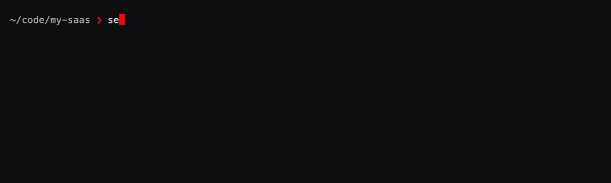

# Running commands with your secrets

`sekrt run` gives one process the secrets it needs, in its environment, for
exactly as long as it runs — then they are gone. `sekrt shell` does the same for
a whole subshell.

This is the long version. The [README section](../README.md#running-a-command-with-your-secrets)
covers the three commands most people ever type.

- [Why not `sekrt expose`](#why-not-sekrt-expose)
- [What a command gets](#what-a-command-gets)
- [Narrowing it](#narrowing-it)
- [The quoting rule](#the-quoting-rule)
- [A whole session](#a-whole-session)
- [Command reference](#command-reference)
- [What it does and does not protect](#what-it-does-and-does-not-protect)
- [Troubleshooting](#troubleshooting)

## Why not `sekrt expose`

The obvious design is the one that cannot work:

```bash
sekrt expose && service log --token="$MY_TOKEN"     # ✗ never going to work
```

A child process cannot set variables in the shell that started it. The variant
that could — `eval "$(sekrt expose)"` — leaves every secret in that shell for the
rest of the session, inherited by everything you start from it, with nothing to
say when it should stop and no way to tell whether it already did.

So sekrt holds the secrets and wraps the command instead. The exposure has a
beginning and an end, and the end is the process exiting.

## What a command gets

With nothing named, `sekrt run` takes two sources, in this order (`sekrt shell`
is stricter — see [a whole session](#a-whole-session)):

| Source | Exposed as |
| --- | --- |
| every `password` and `api_key` entry | the variable its name reads as — `api/my-token` answers `$MY_TOKEN` |
| the `.env` files this repo stored with `sekrt env push` | the names the file uses; these win where the two collide |

The name mapping is the last path segment, uppercased, with anything that isn't
a letter, digit or underscore becoming one: `cloud/aws-access-key` is
`$AWS_ACCESS_KEY`, `tokens/uv-publish-token` is `$UV_PUBLISH_TOKEN`.

Left out of the unnamed exposure, because a variable is the wrong shape for
them:

- **notes** — prose, not a value
- **SSH keys** — a key belongs in a file with `0600` on it (`sekrt ssh restore`)
- **stored files** — bytes (`sekrt file get`)
- **names that aren't variable names** — `codes/2fa-backup` wants `$2FA_BACKUP`,
  which no shell will accept
- **variables two entries both answer to** — `a/token` and `b/token` both want
  `$TOKEN`; sekrt says so and leaves it unset rather than picking one of two
  secrets for you

Any of them can still be exposed deliberately: `-e KEY=ssh/deploy-key` means what
it says.

`-n` / `--dry-run` prints the whole list — names and sources, never values — and
runs nothing:

```console
$ sekrt run -n 'npm start'
AWS_ACCESS_KEY          cloud/aws-access-key:key
DATABASE_URL            env/github.com/you/my-saas/.env
GITHUB_TOKEN            work/github-token:key
PORT                    env/github.com/you/my-saas/.env
UV_PUBLISH_TOKEN        tokens/uv-publish-token:key

would run: /bin/zsh -c npm start
```

## Narrowing it

`-e` is the switch: name variables and those are what the command gets.

```bash
sekrt run -e UV_PUBLISH_TOKEN 'uv publish'              # this one + the repo's .env
sekrt run -e TOKEN=work/github-token 'gh pr list'       # this one, from that entry
sekrt run -e UV_PUBLISH_TOKEN --no-env-files 'uv publish'    # this one, alone
```

- `-e VAR` — take `VAR` from wherever it resolves (repo env file, then the entry
  whose name reads as `VAR`)
- `-e VAR=entry/name` — take it from that entry's main secret field, whatever the
  entry is called
- `--no-env-files` — leave this repository's stored env files out
- `--repo <slug>` — use another repository's stored files (`github.com/you/proj`),
  for forks, renames, or running from outside the checkout

For anything you did not write yourself — a build script, a third-party CLI, a CI
step — `-e` plus `--no-env-files` is one flag more to type and a much smaller
blast radius.

## The quoting rule

This is the one thing to get right. **Your shell expands what you type, before
sekrt runs.** Only sekrt's *child* knows the values, so only a shell inside that
child can expand a reference to one.

```bash
sekrt run echo $MY_TOKEN          # ✗ your shell drops it; sekrt gets bare `echo`
sekrt run "echo $MY_TOKEN"        # ✗ double quotes; sekrt gets `echo `
sekrt run 'echo $MY_TOKEN'        # ✓ single quotes: sekrt's shell expands it
sekrt run -- printenv MY_TOKEN    # ✓ and this is how to check it landed
```

The two forms, and when to reach for each:

- **`sekrt run 'STRING'`** — a command quoted into one argument — hands `STRING`
  to `$SHELL`, which is what expands `$VAR` in it. This is the form to type, and
  the one that works when the command interpolates the value into its own
  arguments, or when you want a pipeline.
- **`sekrt run -- CMD ARGS...`** runs `CMD` directly, with the variables in its
  environment and no shell at all — nothing to quote, nothing to escape. Put `--`
  first, so `CMD`'s own flags are not read as sekrt's.

sekrt tells them apart by looking at what you typed: one argument holding a
space, a `$`, a quote, a pipe or a redirect was written for a shell; anything
else is a program and its arguments. `sekrt run make` and `sekrt run -- make`
are the same thing, and `-c` still forces the shell form for the rare string
that has none of those characters.

sekrt never substitutes a secret into a command line itself, in either form: a
value in `argv` is readable by anyone who can run `ps`. It does call out the
shapes it can still recognise:

```console
$ sekrt run -e MY_TOKEN -- service log --token='$MY_TOKEN'
note: $MY_TOKEN reached the command as text — sekrt never writes a secret into a
      command line (`ps` can read those).
      the program can read MY_TOKEN from its environment, or let a shell expand
      it:  sekrt run '… $MY_TOKEN …'
```

```console
$ sekrt run -- service --token=$MY_TOKEN
note: '--token=' looks like a variable your own shell expanded
      away before sekrt ran — it expands what you type, and only sekrt's own child
      knows the value. Single-quote it and let a shell do it:
        sekrt run 'svc --token="$VAR"'
      or check what the command will see:  sekrt run -- printenv VAR
```

A quoted command arriving with a hole in it — a trailing space, a gap of two, an
argument ending in `=` — gets the same treatment. The one case nothing can catch
is `sekrt run echo $MY_TOKEN` unquoted: an unset unquoted variable removes the
argument altogether, leaving nothing behind to notice.

## A whole session

When one command isn't the shape of the work:

```console
$ sekrt shell -e UV_PUBLISH_TOKEN -e GITHUB_TOKEN
✔ 4 variables exposed in this subshell — the prompt says (sekrt) until you `exit`
  DATABASE_URL, GITHUB_TOKEN, PORT, UV_PUBLISH_TOKEN
(sekrt) ~/code/my-saas ❯ uv publish            # ordinary shell, ordinary expansion
(sekrt) ~/code/my-saas ❯ echo $UV_PUBLISH_TOKEN   # ordinary quoting rules, too
(sekrt) ~/code/my-saas ❯ exit
~/code/my-saas ❯
```



`sekrt shell` takes the same options as `run` — `-e`, `-n`, `--no-env-files`,
`--repo` all mean what they mean there — but not the same default. `run` bounds
its exposure by the command: it ends when the command does, so handing an unnamed
one everything is a small thing. A subshell ends when you remember to `exit`, and
until then every variable is inherited by everything you start from it. So there
is no unnamed whole vault:

```console
$ sekrt shell -e UV_PUBLISH_TOKEN       # this one (+ this repo's stored .env)
$ sekrt shell                           # this repo's stored .env, and nothing else
$ sekrt shell --all                     # the whole vault — asks first
```

With nothing to expose at all — no `-e`, no `--all`, no env file stored for this
repo — nothing is decrypted and nothing opens:

```console
$ sekrt shell
Error: nothing named — say what to expose:
  sekrt shell -e MY_TOKEN
  sekrt shell -e MY_TOKEN -e OTHER_TOKEN
  sekrt shell --all          (every password and API key in the vault)
  no env file is stored for 'github.com/you/my-saas' either — `sekrt env push` stores this repo's
```

`--all` is the `run` default, made deliberate. It names what it is about to hand
over and waits for an answer, since "every secret I own, in a shell I may leave
open all afternoon" is worth one keypress:

```console
$ sekrt shell --all
⚠ this exposes all 5 secrets the vault can offer as variables to that
  subshell and to everything you start from it:
  AWS_ACCESS_KEY, DATABASE_URL, GITHUB_TOKEN, PORT, UV_PUBLISH_TOKEN
Expose all 5? [y/N]:
```

`-y` / `--yes` answers it in advance. Without a terminal to ask on and without
`-y`, `--all` refuses rather than assuming yes — a script that wanted the whole
vault can say so.

### The tag in the prompt

A shell holding secrets shouldn't look like an ordinary one, so `sekrt shell`
prefixes your prompt with `(sekrt)` and leaves everything else — theme, aliases,
functions, history — exactly as it was. Plain ASCII, in the shape `(venv)` and
`(nix-shell)` already taught everyone to read: an emoji here would be two display
cells the shell counts as one character, which is how a prompt ends up misplacing
the cursor halfway through a long edited line.

`PS1` handed over in the environment would not survive: the `.bashrc` or `.zshrc`
that runs next sets its own. So the prompt is hooked through the shell's own
startup instead, and how depends on the shell:

| Shell | How |
| --- | --- |
| bash | started against a generated rc that sources `~/.bashrc` first, then appends a `PROMPT_COMMAND` hook |
| zsh | `ZDOTDIR` points at a generated pair that sources your real `.zshenv`/`.zshrc`, then adds a `precmd` hook |
| fish | `--init-command` wraps `fish_prompt` after `config.fish` has run |
| anything else | no tag — the banner and `$SEKRT_EXPOSED` still say what is going on |

A hook rather than a one-off assignment, because a themed prompt (starship,
powerlevel10k, oh-my-*) rebuilds the prompt before every line and would drop a
prefix set only once. The hook is idempotent, so the tag never stacks up.

The two generated files hold prompt wiring and no secrets, and live in the same
user-private directory as the session cache (`0600` inside `0700`) — an rc file
somebody else can write is code execution, so they may not live in `/tmp`
proper. They carry a `Safe to delete.` header and are rewritten on each run.

If your `~/.zshenv` sets `ZDOTDIR` itself, zsh reads your `.zshrc` instead of the
generated one and the tag does not appear; nothing else changes.

Both commands also set `$SEKRT_EXPOSED` to the *names* of what they exposed (never
the values), which is what to use for an indicator of your own — in an unsupported
shell, or somewhere other than the prompt:

```bash
# e.g. in a tmux status line
#{?$SEKRT_EXPOSED,🔓 ,}
```

## Command reference

```text
sekrt run [OPTIONS] 'STRING'               run STRING through $SHELL, secrets in its env
sekrt run [OPTIONS] -- COMMAND [ARGS]...   ...or an argv, run directly, with no shell
sekrt shell [OPTIONS]                      open a subshell holding them

  -e, --var VAR[=ENTRY]   expose only VAR (optionally naming its entry); repeatable
  -n, --dry-run           list what would be exposed (names and sources) and stop
      --no-env-files      leave this repo's stored .env files out
      --repo SLUG         use another repo's stored env files
  -c, --shell STRING      force the shell form for a string that doesn't look like one
                          (run only)
  -a, --all               expose the whole vault, after confirming     (shell only)
  -y, --yes               answer that confirmation in advance          (shell only)
```

Aliases: `sekrt exec` for `run`, `sekrt sh` for `shell`. The exit status is the
command's own, so `sekrt run pytest` fails a CI step exactly as `pytest` would.

## What it does and does not protect

- Values are written to the wrapped process's **environment only** — not to disk,
  not into your shell, and never into a command line.
- `$SEKRT_PASSPHRASE` is **stripped** from the child, so a wrapped command cannot
  decrypt anything it wasn't handed. (If a script you wrap needs the vault
  itself, run `sekrt unlock` first and it will use the session cache.)
- On POSIX, sekrt `exec`s the command: no part of sekrt stays running with the
  key in memory, and signals and exit status are the command's own.
- **Everything the command starts inherits the variables.** That is what makes
  the feature useful and it is also the whole of its limit — a program that logs
  its own environment will log them. `-e` is how you decide what is in reach.
- On Linux, `/proc/<pid>/environ` is readable only by you and root — the same
  trust boundary the process already sits inside. `argv` (`/proc/<pid>/cmdline`)
  is world-readable, which is why sekrt never puts a secret there.

## Troubleshooting

**"Output is empty."** Almost always the [quoting rule](#the-quoting-rule). Check
with `sekrt run -- printenv MY_TOKEN`; if that prints the value, the exposure is
fine and the reference was eaten by your own shell.

**"nothing to expose".** The vault holds no `password` or `api_key` entries and
this directory has no stored env files. Add one (`sekrt add`) or store this
repo's file (`sekrt env push`). Nothing is decrypted and no passphrase is asked
for before this check.

**"`$TOKEN` left unset — a/token and b/token both answer to it."** Two entries
map to one variable. Pick one: `-e TOKEN=a/token`, or rename an entry with
`sekrt mv`.

**"nothing in the vault answers `$FOO`".** With `-e FOO` this is fatal (nothing
would have been exposed); when a `-c` command merely mentions `$FOO` it is a note
and the command still runs, since a shell command may use variables of its own.
The message suggests near matches — it is usually a typo.

**A wrapped script calls `sekrt` and now fails.** The passphrase is deliberately
not inherited. Run `sekrt unlock` first; the session cache is shared.

## Regenerating the GIF on this page

The recordings are [VHS](https://github.com/charmbracelet/vhs) tapes, and each
rebuilds its own fixture — a throwaway vault and a repo with a stored `.env`
under `/tmp/sekrt-vhs-run` (or `/tmp/sekrt-vhs-shell`), with `$HOME` pointed at
it, so your real vault is never in reach:

```bash
vhs docs/vhs/run.tape       # -> docs/run.gif
vhs docs/vhs/shell.tape     # -> docs/shell.gif
vhs docs/vhs/forms.tape     # -> docs/forms.gif (the inline form)
```
